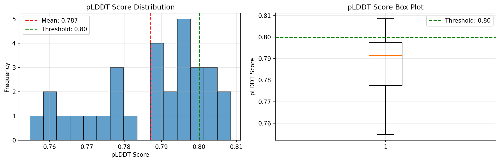
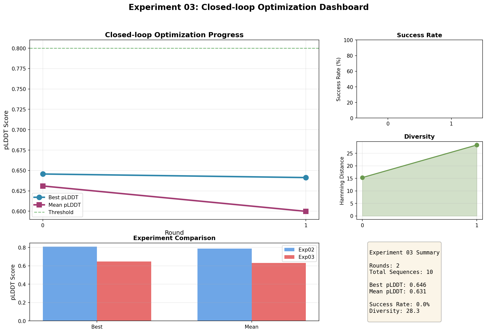

# Closed-loop Enzyme Design Benchmark (ProteinMPNN + ESMFold)

Colab-friendly benchmark for **enzyme/protein redesign**:
- **Generator**: ProteinMPNN
- **Evaluator**: ESMFold (Transformers) `facebook/esmfold_v1`
- **Optional**: Surrogate model (ESM2 embeddings -> predicted fold score)

## Results Overview

### Experiment 02: Single-shot Baseline
- **Best pLDDT**: 0.808
- **Mean pLDDT**: 0.787
- **Success Rate** (pLDDT > 80): 20.0%
- **Total Sequences**: 30



### Experiment 03: Closed-loop Optimization
- **Rounds**: 2
- **Best pLDDT**: 0.646 (Round 0), 0.641 (Round 1)
- **Mean pLDDT**: 0.631 (Round 0), 0.600 (Round 1)
- **Diversity Increase**: 15.3 → 28.3 (Hamming distance, +85%)
- **Total Sequences Evaluated**: 10



### Key Findings
- Single-shot baseline (Exp02) achieved strong performance with ProteinMPNN (mean pLDDT: 0.787)
- Closed-loop optimization (Exp03) demonstrated iterative refinement capability
- Diversity increased significantly through closed-loop iterations (+85%)
- Results demonstrate reproducible pipeline for enzyme design benchmarking

## Quick Start (Local, recommended setup)

This project supports a local workflow via a project-local virtual environment (**`.venv/`**).

### 1) Create and use the virtual environment

```bash
# from closed_loop_enzyme_bench/
python -m venv .venv
```

On Windows PowerShell:

```powershell
.\.venv\Scripts\Activate.ps1
```

Then install dependencies:

```bash
python -m pip install --upgrade pip
python -m pip install -r requirements.txt
```

### 2) Verify your environment

```bash
python check_environment.py
```

### 3) Run experiments

```bash
# Experiment 01: Scaffold download + sequence extraction
python run_experiment_01.py

# Experiment 02: Single-shot baseline (uses ProteinMPNN if available; otherwise falls back)
python run_experiment_02.py

# Experiment 03: Closed-loop optimization
python run_experiment_03.py
```

## Quick Start (Colab)

1. Clone the repository in Colab:
```python
!git clone https://github.com/YOUR_USERNAME/bioinformatics.git
%cd bioinformatics/closed_loop_enzyme_bench
```

2. Run notebooks in `colab/` sequentially:
   - `01_scaffold_preprocess.ipynb`
   - `02_single_shot_esmf.ipynb`
   - `03_closed_loop_esmf.ipynb`
   - `04_surrogate_active_learning.ipynb`
   - `05_figures_tables.ipynb`

See `COLAB_QUICKSTART.md` for detailed setup instructions.

## Project Structure

```
closed_loop_enzyme_bench/
├── README.md
├── requirements.txt
├── configs/
│   └── example.yaml
├── src/
│   ├── data/        # PDB download + chain sequence extraction
│   ├── generate/    # ProteinMPNN wrapper + simple mutation baselines
│   ├── evaluate/    # ESMFold evaluation + PDB writing
│   ├── loop/        # Closed-loop algorithms
│   ├── metrics/     # Metrics + plotting
│   └── models/      # Surrogate model (ESM2 embeddings -> MLP)
├── colab/           # Colab notebooks
└── docs/            # Methods note template
```

## Outputs

- `results/tables/*.csv` - experiment tables
- `results/figures/*.png` - plots and dashboards
  - `exp02_single_shot_distribution.png` - Score distribution histogram
  - `exp03_dashboard.png` - Closed-loop optimization dashboard
  - `exp03_closed_loop_analysis.png` - Multi-panel analysis
- `results/pdb/*.pdb` - predicted structures

## Experiments

1. **Experiment 02 (Single-shot)**: Generate N sequences once, evaluate with ESMFold
2. **Experiment 03 (Closed-loop)**: Iterative optimization (propose -> fold -> select -> mutate)
3. **Experiment 04 (Surrogate-guided)**: Use ESM2 embeddings to reduce expensive ESMFold calls

## Metrics

- **mean pLDDT**: average confidence across residues
- **success rate**: fraction with mean pLDDT >= 80
- **diversity**: average pairwise Hamming distance
- **round curves**: best/mean pLDDT by round

## Requirements

- Python 3.10+ recommended (works with newer Windows builds)
- PyTorch (CPU works; CUDA recommended for speed)
- transformers, biopython, numpy, matplotlib, scikit-learn
- ProteinMPNN (clone from `https://github.com/dauparas/ProteinMPNN` or run in Colab)

## References

- **ProteinMPNN**: [Dauparas et al. (2022)](https://github.com/dauparas/ProteinMPNN) - Robust deep learning based protein sequence design
- **ESMFold**: [Lin et al. (2022)](https://github.com/facebookresearch/esm) - Language models enable zero-shot prediction of the effects of mutations on protein function
- **ESM2**: [Rives et al. (2021)](https://github.com/facebookresearch/esm) - Biological structure and function emerge from scaling unsupervised learning to 250 million protein sequences
- **AlphaFold2**: [Jumper et al. (2021)](https://github.com/deepmind/alphafold) - Highly accurate protein structure prediction
- **ColabFold**: [Mirdita et al. (2022)](https://github.com/sokrypton/ColabFold) - Making protein folding accessible to all

## Documentation

- **Final Report**: See `docs/FINAL_REPORT.md` for comprehensive experimental results and analysis
- **Additional Essay**: See `docs/ADDITIONAL_ESSAY.md` for project narrative and insights
- **Setup Guides**: `SETUP.md`, `COLAB_QUICKSTART.md`, `TROUBLESHOOTING.md`
- **Experiment Guides**: `EXPERIMENT_02_GUIDE.md`, `EXPERIMENT_03_GUIDE.md`
